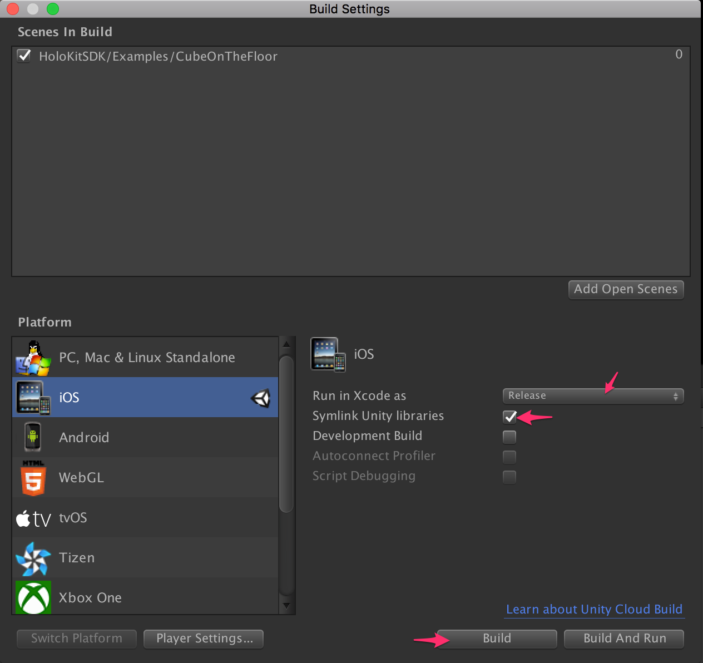
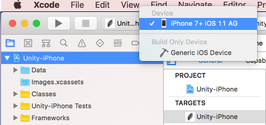
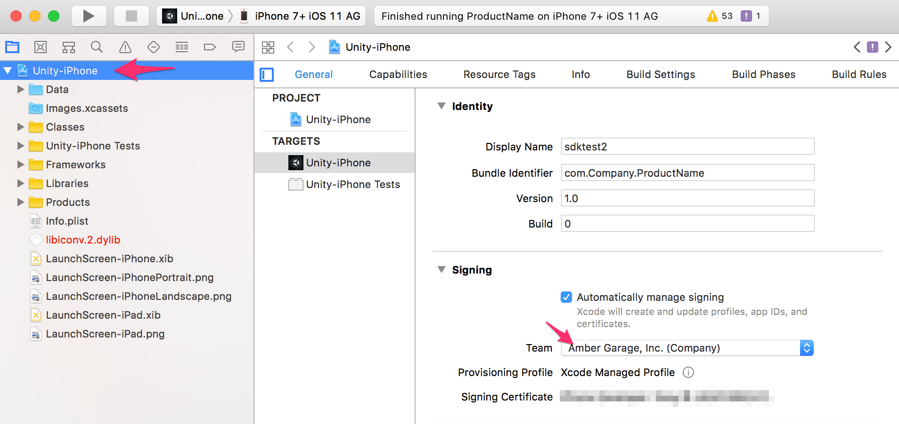
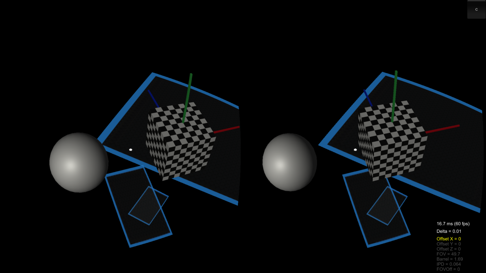
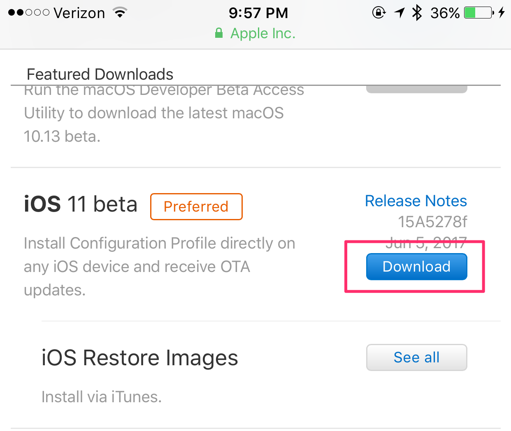
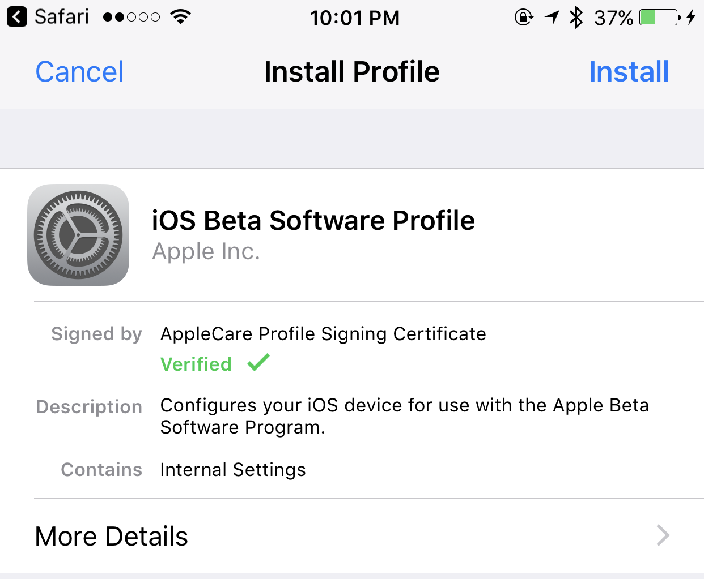

#HoloKitSDK v1.0
HoloKitSDK is to build AR apps for HoloKit. Currently, we provide the SDK as Unity package, and it runs on iOS devices that supports ARKit. 

For detailed manual, please see [HoloKitSDK Reference Manual](docs/MANUAL.md).

## Prerequists
* You must be an [Apple Developer](https://developer.apple.com/programs/). 
* An iOS device that supports ARKit and running iOS 11.
    * We tested HoloKitSDK with iPhone 7 Plus. 
    * See below for guidance on upgrading to iOS 11 beta. 
* [Unity 5.6.1p3](http://beta.unity3d.com/download/ede8e3f4adbd/UnityDownloadAssistant-5.6.1p3.dmg?_ga=2.258563906.935844948.1497834147-2116713852.1480749648) or later. Make sure you installed iOS components.
* [XCode 9 Beta](https://developer.apple.com/download/). You need to log in with your Apple Developer account. 

## Quick Start
1. Download [HoloKitSDK.unitypackage](HoloKitSDK.unitypackage) and import it into a new Unity project.
2. You might be prompted to switch to iOS platform. If so please go ahead and switch. 
3. Open the example scene "HoloKitSDK/Examples/CubeOnTheFloor".
4. Open "File" -> "Build Settings" and click "Build". 
    * 
5. Choose a location to put the XCode project. After the build is done, open "Unity-iPhone.xcodeproj". Make sure you open it with XCode 9 Beta.
6. In Xcode, change your build target to your actual device. 
    * 
6. Click "Unity-iPhone" in the file explorer to see its settings, and select the proper Team. If you don't have any Team listed, go to "XCode" -> "Preferences" -> "Accounts" and add your Apple Developer account. 
    *  
7. Click "Run" to build and launch the example on your device. 
8. If you get build failure regarding code signing, try to understand [Launching Your App on Devices](https://developer.apple.com/library/content/documentation/IDEs/Conceptual/AppDistributionGuide/LaunchingYourApponDevices/LaunchingYourApponDevices.html#//apple_ref/doc/uid/TP40012582-CH27-SW4). For other problems see Troubleshooting below.
9. After the app runs, you should see a cube and a sphere floating in the air somewhere. You may gaze at the sphere and it'll turn to red. 
    * 
10. The app detects planes, and you may click on the screen to place the cube on the plane. 
    * 
11. You may touch the small "C" button to switch to HoloKit mode. 
    * 

## Create your own experience
1. Create a new scene in Unity. 
2. Drag and drop everything in "HoloKitSDK/StarterPrefabs" to the scene, and delete the default "Main Camera" and "Directional Light". 
    * 
3. Put anything you like under "HoloKitPlacementRoot", and your model should have a comparable size as "DebugCube". Then feel free to turn off or delete "DebugCube". 
    * 
4. Build your scene and run!
  
## How to upgrade to iOS 11 Beta
1. Backup your device. See "Prepare your device before you update to beta software" section in [About iOS beta software](https://support.apple.com/en-us/HT203282)
2. Follow [iOS beta Software Installation Guide](https://developer.apple.com/support/beta-software/install-ios-beta/) to install iOS 11 Beta. Briefly,
    1. Use Safari on your **iOS device** to open [https://developer.apple.com](https://developer.apple.com) and login with your Apple Developer account.
    2. Go to [https://developer.apple.com/download](https://developer.apple.com/download) and click "Download" button for iOS 11 beta. 
        * 
    3. In the pop-up window, click "Install" 
        * 
    4. After accepting the agreement and restarting your device, you could install iOS 11 Beta from "Settings" -> "General" -> "Software Update". 
        * 
  
## Troubleshooting
* I don't have an Apple Developer account. 
    * You need one.
* I cannot see any "Team" in my XCode project settings.
    * Make sure "Automatically manage signing" is checked, and you've logged in with your developer account in "XCode" -> "Preferences" -> "Accounts". 
* [WIP]

## Contribution
[WIP]