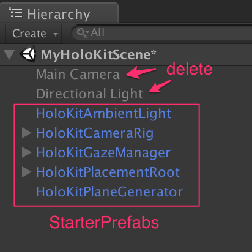

#HoloKitSDK v1.0 (Android Branch)

HoloKitSDK is to build AR/MR apps for HoloKit. Currently, we provide the SDK as Unity package.

- For Google Tango, please checkout "tango" branch.
- For Apple iOS (ARKit), please checkout "ios" branch. 
- For Android (ARCore), please checkout "android" branch. 

For detailed manual, please see [HoloKitSDK Reference Manual](docs/MANUAL.md).

## Prerequists
* You must be an [Apple Developer](https://developer.apple.com/programs/). 
* An Android device that supports ARCore with Android SDK version 7.0 (API Level 24) or higher.
- Google Pixel and Pixel XL (tested)
- Samsung Galaxy S8
* Unity 2017.2 Beta 9 or later. Make sure you installed Android components.
* Android Studio with Android SDK installed.
- Prepare your device
  - Enable developer options
  - Enable USB debugging
  - Download the [ARCore Service](https://github.com/google-ar/arcore-android-sdk/releases/download/sdk-preview/arcore-preview.apk), then install it with the following adb command: 
    adb install -r -d arcore-preview.apk

## Quick Start
1. Import "HoloKitSDK" folder under "Assets" folder into a new Unity project.
2. Open the example scene "HoloKitSDK/Examples/CubeOnTheFloor".
3. Change the target platform to Android and click Switch Platform.
Click Player Settings to open the Android Player Settings. Then change the following settings:

    - Other Settings > Multithreaded Rendering: Off
    - Other Settings > Package Name: a unique app ID that looks like a Java package name, such as com.example.helloAR
    - Other Settings > Minimum API Level: Android 7.0 or higher
    - Other Settings > Target API Level: Android 7.0 or 7.1
    - XR Settings > Tango Supported: On
    
4. Open "File" -> "Build Settings" and click "Build". 

## Create your own experience
1. Create a new scene in Unity. 
2. Drag and drop everything in "HoloKitSDK/StarterPrefabs" to the scene, and delete the default "Main Camera" and "Directional Light". 
    * 
3. Put anything you like under "HoloKitPlacementRoot", and your model should have a comparable size as "DebugCube". Then feel free to turn off or delete "DebugCube". 
    * 
4. Build your scene and run!
5. If you don't like the ambient light, please disable HoloKitAmbientLight in your scene.

## Attribution

You shall read the [How to Attribute](https://holokit.io/#develop) section.

App developer shall mark with the words, "Works with HoloKit", or display either of the following two Holokit Logos in your app.

or 

For academic work, please cite Monocular Visual-Inertial State Estimation for Mobile Augmented Reality, P.Li et al (ISMAR 2017, accepted)

 