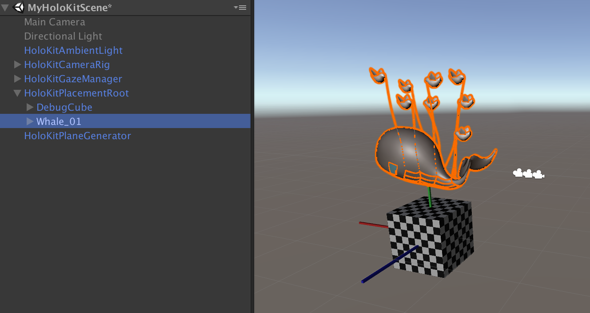
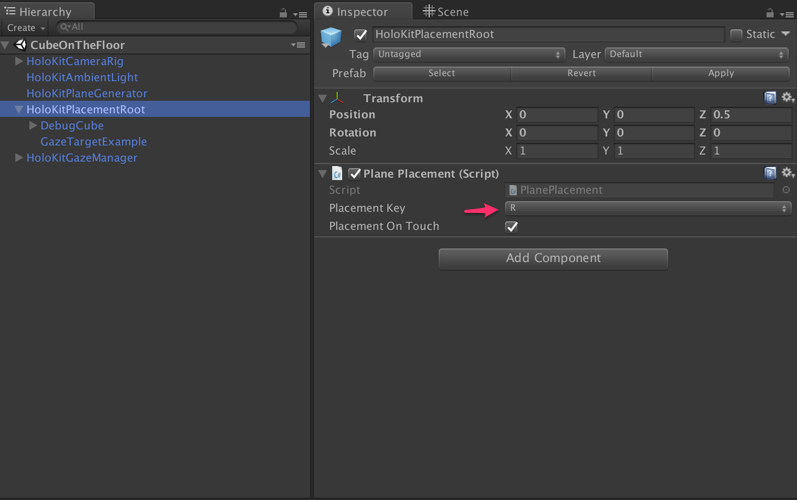

# HoloKitSDK v1.5 (Branch)

HoloKitSDK is the Unity plugins to build AR/MR apps for HoloKit. 

## Features 

* Stereosopic rendering
* Calibration profile for different holokits and phones
  - It's the key to have a correct Holokit experience. Wrong calibration may lead to eye discomfort.
* AR/MR Mode Switch
  - You can easily switch betwen AR and MR mode. 
* Screen Brightness Control.
  - Make sure that the brightness of phone screen are the best for the current environment during the MR experience. 
* Universal wrapper for ARCore and ARKit.
  - HoloKit SDK integrates both ARCore and ARKit. It will seamlessly compile to Android and iOS devices. You don't need worry about the switch between platforms.
* [ARKit v1.5 or above] Horizontal and vertical plane detection.
* [ARKit v1.5 or above] Image marker detection.
 
## News 

* Feb 23, 2018. Added ARcore 1.0 support.
* Feb 23, 2018. Added ARKit 1.5 beta support. 

## Supported Devices

* iOS (ARKit): iPhone 6S, 7, 8, 6S+, 7+, 8+, X.
* Android (ARCore): Google Pixel, Pixel XL, Pixel 2, Pixel 2 XL, Asus Zenfone AR, LG V30, OnePlus 5, Samsung Galaxy S7, S7 Edge, S8, S8+, Note8. See more: [the full list of supported Android devices](https://developers.google.com/ar/discover/#supported_devices))

## Version Index

### HoloKit SDK v1.5 (Current version): 
* For ARKit 1.5 beta and ARCore 1.0, please checkout "master" branch.

### HoloKit SDK v1.0 (Legacy version):
* For Google Tango, please checkout "tango" branch.
* For Apple iOS (ARKit), please checkout "ios" branch. 
* For Android (ARCore), please checkout "android" branch. 

## How to get started? 

### Prerequists(iOS)
* You must be an [Apple Developer](https://developer.apple.com/programs/). 
* An iOS device that supports ARKit v1.5 and running iOS 11.3.
* [XCode 9.3](https://developer.apple.com/download/). You need to log in to download it with your Apple Developer account. 
* Unity 2017.3.1f3 or later. Make sure you installed iOS components.
    1. Change the target platform to iOS and click Switch Platform.
    2. Open "File" -> "Build Settings" and click "Build". 
Make sure that the paramaters below is correct. Player Settings -> Other Settings
        * Artectecture: ARM64
        * Camera Usage Description: "Blahblah...".
        * Target minimum iOS version: 11.3
 
### Prerequists(Android)
* An Android device that supports ARCore with Android SDK version 7.0 (API Level 24) or higher.
    * Prepare your device
    - Enable developer options
    - Enable USB debugging
* Android Studio with Android SDK installed.
* Unity 2017.3.1f3 or later. Make sure you installed Android components.
    1. Change the target platform to Android and click Switch Platform.
    2. Click Player Settings to open the Android Player Settings. Then change the following settings:
        - Other Settings > Multithreaded Rendering: Off
        - Other Settings > Package Name: a unique app ID that looks like a Java package name, such as com.example.helloAR
        - Other Settings > Minimum API Level: Android 7.0 or higher
        - Other Settings > Target API Level: Android 7.0 or 7.1
       - XR Settings > ARCore Supported: On
   

### Quick Start - Universal (iOS and Android)
1. Import "HoloKitSDK" folder under "Assets" folder into a new Unity project.
2. Open the example scene "HoloKitSDK/Examples/HoloKitSample_Universal".
3. Build your scene and run! This scene can run on both iOS and Android.
3. After the app runs, you should see a cube floating in the air somewhere. You may gaze at the sphere.
4. The app detects planes, and you may click on the screen to place the cube on the plane. 
5. You may touch the small "AR/MR" button to switch to HoloKit mode. 

### Quick Start - ARKit v1.5 Only (iOS 11.3)
1. Import "HoloKitSDK" folder under "Assets" folder into a new Unity project.
2. Open the example scene "HoloKitSDK/Scenes/HoloKitSample_ARKit1.5".
3. You can detect the vertical plane.
4. You can detect the image marker under "Assets/UnityARKitPlugin/Examples/ARKit1.5/UnityARImageAnchor/ReferenceImages/unitylogowhiteonblack.png". 
 * 

### Create your own experience
1. Create a new scene in Unity. 
2. Drag and drop everything in "HoloKitSDK/Prefabs/Universal" to the scene.
3. Put anything you like under "HoloKitPlacementRoot", and your model should have a comparable size as "DebugCube". Then feel free to turn off or delete "DebugCube". 
4. Build your scene and run!
5. If you don't like the ambient light, please disable HoloKitAmbientLight in your scene.

## Manual 
  
### Prefabs
#### HoloKitCamera
* The most basic component to have your game responds to ARKit tracking. 
* It has a child VideoSeeThroughCamera that renders video seethrough VR experience. There are two extra cameras "Left Eye", "Right Eye" as its children, to render stereo for HoloKit. In "HoloKitCameraRig" object, you can set default see through mode and the key for toggling modes. 

#### HoloKitObjectGenerator

##### DisplayPlanes 
* To generate collidable planes when ARKit detects a plane. Optionally, you can set a Plane Prefab as its property to visualize the generated planes.

##### PointCloud
* To visualize point clouds that ARKit detects, for debugging purpose. 

##### AmbientLight
* A directional light, which intensity is controlled by ARKit. The intensity will adjust automatically based on the current environment's lighting in reality.

##### HoloKitPlacementRoot
* A convenient prefab to help you place your objects on the ground. See "How to place your object on the ground" for details.

#### HoloKitGazeManager
* A convenient prefab for you to emit gaze events. See "How to respond to gaze events" for details.

### How to place your object on the ground
1. Drag "HoloKitPlaneGenerator" and "HoloKitPlacementRoot" to your scene.
2. Put your object under "HoloKitPlacementRoot", and your object should have a comparable size as "DebugCube". Then feel free to turn off or delete "DebugCube".
    * 
3. Set the input key for placement.
    * 

## Troubleshooting
### How to upgrade to iOS 11.3 Beta?
1. Backup your device. See "Prepare your device before you update to beta software" section in [About iOS beta software](https://support.apple.com/en-us/HT203282)
2. Follow [iOS beta Software Installation Guide](https://developer.apple.com/support/beta-software/install-ios-beta/) to install iOS 11.3 Beta.

### I don't have an Apple Developer account. 
You need one.

### I cannot see any "Team" in my XCode project settings.

Make sure "Automatically manage signing" is checked, and you've logged in with your developer account in "XCode" -> "Preferences" -> "Accounts". 

## Attribution

You shall read the [How to Attribute](https://holokit.io/#develop) section.

App developer shall mark with the words, "Works with HoloKit", or display either of the following two Holokit Logos in your app.

or 

For academic work, please cite Monocular Visual-Inertial State Estimation for Mobile Augmented Reality, P.Li et al (ISMAR 2017, accepted)

 
