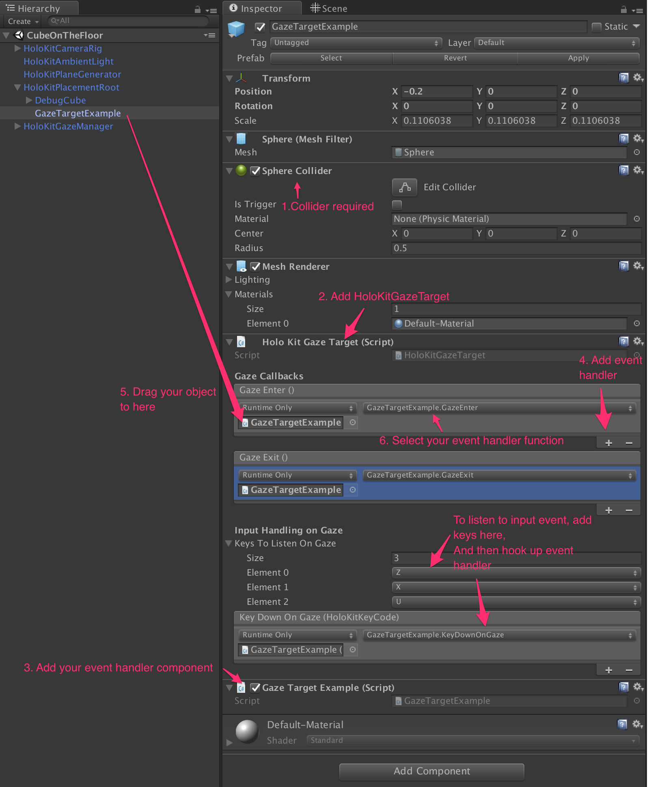

# HoloKitSDK v1.0 Manual
# Prefabs
### HoloKitCameraRig
* The most basic component to have your game responds to ARKit tracking. 
* It has a child VideoSeeThroughCamera that renders video seethrough VR experience. There are two extra cameras "Left Eye", "Right Eye" as its children, to render stereo for HoloKit. In "HoloKitCameraRig" object, you can set default see through mode and the key for toggling modes. 

### HoloKitPlaneGenerator
* To generate collidable planes when ARKit detects a plane. Optionally, you can set a Plane Prefab as its property to visualize the generated planes.

### HoloKitPlacementRoot
* A convenient prefab to help you place your objects on the ground. See "How to place your object on the ground" for details.

### HoloKitAmbientLight
* A directional light, which intensity is controlled by ARKit. The intensity will adjust automatically based on the current environment's lighting in reality.

### HoloKitGazeManager
* A convenient prefab for you to emit gaze events. See "How to respond to gaze events" for details.

### PointCloud
* To visualize point clouds that ARKit detects, for debugging purpose. 

### Calibration Canvas
* A debugging UI to help you calibrate HoloKit hardware. See "How to calibrate for HoloKit Hardware" for details.

# Interaction
* You may use `HoloKitInputManager.GetKeyDown(HoloKitKeyCode.<KeyCode>)` to get input event from the player. To get input together with gaze events, see "How to respond to gaze events". 
* `HoloKitInputManager.GetKeyDown` **must be caleld in `Update()` function**. Not in `OnGUI()`, neither `LateUpdate()`. 
* We support multiple ways for interaction, and HoloKitInputManager respects inputs from all of them. 

## Bluetooth keyboard
* You can simply connect a Bluetooth keyboard to your iOS device. Then you use `HoloKitInputManager.GetKeyDown` to get key down events. For example, 

```
    public class MyBehavior : MonoBehavior {
        void Update() {
            if (HoloKitInputManager.GetKeyDown(HoloKitKeyCode.A)) {
                Debug.Log("'A' pressed!");
            }
        }
    }
```

## Utopia bluetooth controller
* [Utopia Bluetooth Controller](http://www.myretrak.com/vr/product.aspx?item_id=1) is a small game controller. Underlying it's nothing more but a Bluetooth keyboard. HoloKitKeyCode defines key mappings for this controller. 
* By default, you can press "B" button on the controller to place an object on the ground, and "C" button to toggle between video seethrough and HoloKit seethrough modes. 

## Another mobile device
* HoloKitSDK allows you to run a controller app on another mobile device, so that you can read key-press events, as long as the other device's orientation and position. 
* [WIP]

## Remote keyboard for debugging
* If you don't have any Bluetooth device in hand, you may also use your computer's keyboard. To do that, make sure your computer and your device are in the same network, and then launch the following command to send UDP packet to the device:

```
    while read -n 1 x; do echo $x > /dev/udp/<your_device_ip>/5555; done
```

# How to...
## Place your object on the ground
1. Drag "HoloKitPlaneGenerator" and "HoloKitPlacementRoot" to your scene.
2. Put your object under "HoloKitPlacementRoot", and your object should have a comparable size as "DebugCube". Then feel free to turn off or delete "DebugCube".
    * 
3. Set the input key for placement.
    * 
    
## Make an game object respond to gaze events
1. Drag "HoloKitGazeManager" to your scene.
2. Make sure there is a collider on the object that you want to make as gazable.
3. Add a "HoloKitGazeTarget" component to the object. You'll notice there are a bunch of events that you can hook up.
4. Create your own MonoBehavior, for example, "GazeTargetExample" and add it to the object. Implement event hanlders for "HoloKitGazeTarget". See "GazeTargetExample.cs".
5. Hookup events in HoloKitGazeTarget to your script. To do that, click "+" button on "Gaze Enter()" or "Gaze Exit()" panel, then drag your object to "None (Object)", and then select the function you want to trigger.
6. Optionally, you can listen to input event while the player is gazing on the object. To do that, first register your keys in "Keys To Listen On Gaze", and then select the function you want to trigger when the user press those keys. The target function should take a single parameter of type `HoloKitKeyCode`. See "GazeTargetExample.cs". 



## Calibrate for HoloKit Hardware

